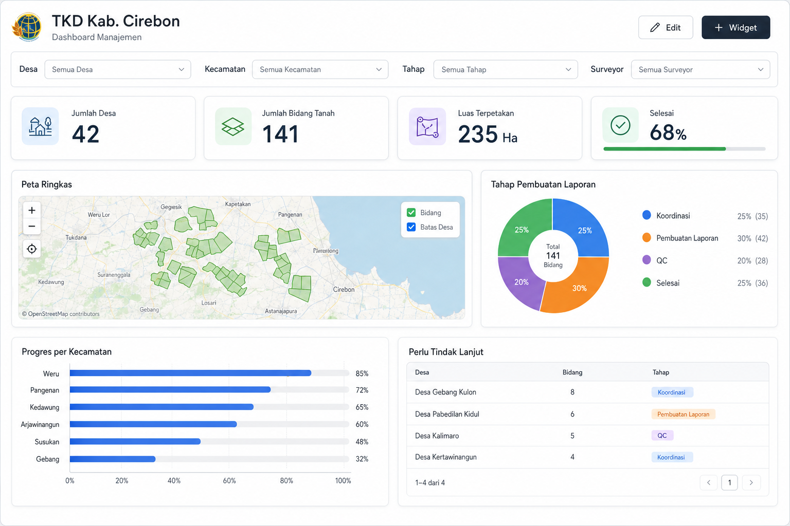

# Dashboard v2 — catatan produk, arsitektur & mockup

**Status:** Fase A ✅ + Fase B ✅ di kode (2026-07-06); perlu migration `0080` di Supabase sebelum uji penuh.  
**Tujuan:** merombak tab **Dashboard** menjadi **workspace operasional ringkas** per Ruang Kerja — agregasi multi-tabel + filter global + (fase berikut) mini-peta — tanpa menduplikasi tab Tabel / Spasial / Obrolan.

**Mockup target UI (setelah coding selesai):**  


**Input ide eksternal (referensi, bukan spesifikasi mentah):**

| Sumber | Fokus |
|--------|--------|
| `02_input/Ide Dashboard Spasial Virtual Table - Google Gemini.pdf` | Widget GIS, grid drag-drop, agregasi spasial, filter global, export |
| `02_input/Ide Dashboard Spasial.pdf` (ChatGPT) | Operational workspace, cross-filter, multi-dashboard, geometry health |

**Referensi internal:**

| Dokumen | Isi |
|---------|-----|
| `docs/workspace-navigation-and-views.md` | Dashboard tetap tab terpisah (agregasi multi-tabel) |
| `docs/workspace-virtual-table-fetch-optimization-notes.md` | Fetch & RPC agregasi v1 (0078) |
| `docs/workspace-spatial-gis-roadmap.md` | Backlog spasial; biaya basemap $0 dulu |
| `docs/workspace-spatial-tab-ux.md` | Tab Spasial penuh ≠ widget mini-map |

**Kode v1 (anchor):**

| Area | File |
|------|------|
| UI dashboard | `app/src/app/virtual-dashboard-view.tsx` |
| Grid / filter / widget body | `dashboard-grid.tsx`, `dashboard-filter-bar.tsx`, `dashboard-widget-body.tsx`, `dashboard-mini-map-widget.tsx` |
| Tipe widget | `app/src/app/virtual-dashboard-types.ts` |
| Server actions | `app/src/app/virtual-dashboard-actions.ts` |
| Agregasi SQL | `lib/dashboard-table-aggregate-server.ts`, migration `0078` |
| Schema | `supabase/migrations/0048_virtual_dashboards.sql` |

---

## 1. Diagnosis v1 (kondisi sekarang)

| Ada | Belum |
|-----|--------|
| 5 jenis widget: `stat`, `status_pie`, `bar_by_group`, `table_preview`, `header` | Drag & drop / posisi Y grid |
| Lebar widget 1–4 kolom | Filter global antar-widget |
| 1 dashboard JSON per proyek | Mini-map |
| Edit / tambah / hapus widget | Cross-filter (klik chart → filter lain) |
| Agregasi SQL pie/bar (0078) + fallback client | `COUNT(DISTINCT)`, `SUM`, agregasi spasial |
| Bootstrap terpisah dari deferred bundle | Multi-dashboard per proyek |

**Kesalahan konseptual v1 yang sudah terlihat di lapangan (TKD):**

- Pie status memaksa bucket **To Do / On Progress / Done** — padahal kolom seperti *Pembuatan Laporan* berisi tahap kerja (*Koordinasi*, *Selesai*, dll.).
- Widget **Angka** dengan filter tidak punya UI filter di v1 awal; slug kolom vs display name bisa tidak cocok.
- Tidak ada **jumlah desa unik** — hanya `COUNT(*)` atau filter exact match.

---

## 2. Visi v2 (satu kalimat)

> Dashboard = **ringkasan operasional** yang menjawab: *berapa progres, di mana, tahap apa, apa yang bermasalah* — dengan filter sekali berlaku ke semua widget, tanpa membuka tab lain.

Bukan pengganti:

| Tab | Tetap untuk |
|-----|-------------|
| **Tabel** | Edit data, view switcher, pagination penuh |
| **Spasial** | Peta dominan, TOC, analisis, trace relasi |
| **Obrolan** | Kolaborasi per baris |
| **Aktivitas** | Audit trail |

---

## 3. Prinsip desain

1. **Jangan duplikasi tab** — Kanban/Kalender/Gantt/Activity feed tidak jadi widget dashboard v2.
2. **Agregasi di DB** — lanjutkan pola RPC (0078+), hindari fetch seluruh baris kecuali fallback / preview kecil.
3. **Filter global satu sumber kebenaran** — state dashboard (`DashboardScope`) dipakai semua widget.
4. **Chart dari nilai kolom apa adanya** — distribusi opsi `select`, bukan hanya bucket status generik.
5. **$0 dulu** — mini-map pakai basemap OSM existing; tanpa satelit/Google (lihat roadmap spasial §8).
6. **Satu proyek, banyak dashboard** (fase C) — mis. Manajemen / Lapangan / QC / Eksekutif.

---

## 4. Layout & interaksi (target mockup)

### Grid

- **12 kolom** responsif (desktop); breakpoint menumpuk ke 1 kolom (mobile).
- Library kandidat: `react-grid-layout` (disarankan Gemini; sudah umum di ekosistem React).
- Persistensi di `virtual_dashboards.widgets`: tambah field `x`, `y`, `h` (selain `w` yang sudah ada).

```ts
// Bentuk widget v2 (konsep)
type DashboardWidgetV2 = {
  id: string;
  type: DashboardWidgetTypeV2;
  title: string;
  x: number;
  y: number;
  w: number;
  h: number;
  config: DashboardWidgetConfigV2;
};
```

### Mode Edit vs View

| Mode | Perilaku |
|------|----------|
| **View** | Widget interaktif (filter, klik baris → detail); tidak ada handle drag |
| **Edit** | Drag, resize, tambah/hapus/duplikat widget; panel pengaturan (dialog/sidebar) |

### Filter global (header dashboard)

Contoh untuk TKD / Progres Desa:

| Filter | Tipe | Efek |
|--------|------|------|
| Desa | `select` / relation | Semua widget memfilter baris |
| Kecamatan | `select` | idem |
| Tahap / Status | `select` multi | idem |
| Surveyor | `user` | idem |

State: `DashboardFilterState` → diteruskan ke `fetchDashboardTableBundleAction` / RPC baru.

---

## 5. Katalog widget (prioritas)

### Fase A — Dashboard v2 dipakai (Tier 1)

| ID | Widget | Deskripsi | Sumber data |
|----|--------|-----------|-------------|
| W-A1 | **KPI / Angka** | COUNT, COUNT DISTINCT, SUM (kolom number) | RPC per tabel + filter global |
| W-A2 | **Distribusi** | Pie/donut/bar dari nilai kolom `select` (nilai asli) | `dashboard_payload_value_counts` (perluas) |
| W-A3 | **Bar per grup** | Hitung per kecamatan/desa + opsi “match status = X” | `dashboard_group_status_counts` |
| W-A4 | **Cuplikan tabel** | N baris + kolom pilihan; klik baris → panel detail / Spasial | fetch terbatas |
| W-A5 | **Judul / teks** | Section header, SOP singkat (markdown ringan) | statis |
| W-A6 | **Filter bar** | Bukan widget grid — bagian header | metadata kolom |

**Contoh layout TKD (lihat mockup):**

- Baris 1: 4× KPI (Desa unik, Bidang, Luas ha, Selesai %)
- Baris 2: Mini-map (kiri 8 kol) + distribusi tahap (kanan 4 kol)
- Baris 3: Bar per kecamatan + cuplikan “perlu tindak lanjut”

### Fase B — Spasial ringkas (Tier 2)

| ID | Widget | Deskripsi |
|----|--------|-----------|
| W-B1 | **Mini-map** | 1–2 layer virtual table; read-only; klik fitur → sorot di cuplikan |
| W-B2 | **Ringkasan spasial** | Total luas (SUM geom atau kolom luas), jumlah poligon terpetakan |
| W-B3 | **Shortcut** | Tombol: buka tab Spasial dengan filter sama, impor, dll. |

### Fase C — Operational & QC (Tier 3)

| ID | Widget | Deskripsi |
|----|--------|-----------|
| W-C1 | **Kesehatan geometri** | overlap, gap, koordinat kosong, invalid ring |
| W-C2 | **Cross-filter** | Klik segmen chart → filter global otomatis |
| W-C3 | **Multi-dashboard** | Picker: Manajemen / Lapangan / QC / Eksekutif |
| W-C4 | **Export widget** | PNG chart, CSV cuplikan |

### Sengaja ditunda (dari PDF ChatGPT)

AI widget, embed YouTube, Kanban/Calendar di dashboard, dashboard per-user, spatial query builder (radius/intersect), basemap satelit.

---

## 6. Arsitektur data (konsep)

```
┌──────────────────────────────────────────────────┐
│ VirtualDashboardView                              │
│  ├─ DashboardFilterBar (global state)             │
│  ├─ DashboardGrid (react-grid-layout)             │
│  │    └─ WidgetCard → WidgetBody                  │
│  └─ DashboardEditDialog                           │
└────────────────────┬─────────────────────────────┘
                     │ DashboardScope { projectId, filters[] }
                     ▼
┌──────────────────────────────────────────────────┐
│ fetchDashboardTableBundleAction(tableId, needs)   │
│  ├─ COUNT / filter counts (existing)              │
│  ├─ RPC 0078 pie/bar (existing + perluas)         │
│  ├─ RPC baru: distinct_count, sum_column          │
│  └─ fallback client aggregate (existing)          │
└──────────────────────────────────────────────────┘
```

**Event bus (fase C):** `DashboardContext` — `filters`, `selectedRowId`, `highlightTableId`; mini-map & cuplikan subscribe.

**Cache:** perluas kunci bundle → `tableId + filterSig + widgetNeedsSig`; TTL selaras `virtual-table-rows-cache` (30 menit) atau invalidasi saat mutasi.

---

## 7. Perubahan schema & API (rencana)

| Item | Perubahan |
|------|-----------|
| `virtual_dashboards` | Opsional: kolom `slug`, `sort_order`; multi-row per `project_id` (fase C) |
| `widgets` JSON | Tambah `x`, `y`, `h`; tipe widget baru |
| Migration | `0080_dashboard_distinct_count.sql`, `0081_dashboard_sum_column.sql`, dll. |
| Tipe TS | `virtual-dashboard-types.ts` — `DashboardWidgetTypeV2`, config per widget |

**Backward compatibility:** migrasi v1 → v2 di load: widget tanpa `x,y,h` di-auto-place berurutan.

---

## 8. Urutan implementasi disarankan

1. **Spesifikasi + mockup** ✅ (dokumen ini + gambar)
2. **Grid layout** — `react-grid-layout`, persist `x,y,w,h` ✅
3. **Filter global** — header + teruskan ke bundle action ✅
4. **Widget distribusi nilai asli** — `value_distribution` ✅
4b. **Chart multi-kolom** — `multi_column_chart` ✅ (satu segmen per kolom tahap paralel, model Excel)
5. **KPI DISTINCT / SUM** — RPC + UI form widget ✅
6. **Mini-map widget** — reuse `WorkspaceMap` kecil / footprint layer ✅
7. **Multi-dashboard + cross-filter**

Setiap increment: update mockup atau screenshot di folder `docs/assets/` jika UI menyimpang.

---

## 9. Kriteria selesai (acceptance) per fase

### Fase A

- [x] User drag/resize widget; layout tersimpan setelah Simpan
- [x] Filter global (kolom select) memfilter semua KPI & chart
- [x] KPI `COUNT(DISTINCT)` dan `SUM` di form widget
- [x] Chart distribusi nilai menampilkan label opsi asli (bukan bucket To Do)
- [x] Chart multi-kolom: beberapa kolom tahap → satu segmen per kolom (tahap paralel; total % boleh >100%)
- [ ] Mobile: grid 1 kolom, filter di sheet/drawer

### Fase B

- [x] Mini-map menampilkan layer tabel virtual; klik poligon menyorot baris di cuplikan
- [x] Tombol “Buka di Spasial” membawa filter global ke sesi view + tab Spasial
- [x] Ringkasan spasial: jumlah poligon & total luas (geometri atau kolom angka)
- [x] Widget pintasan Spasial

### Fase C

- [ ] ≥2 dashboard per proyek dapat dipilih
- [ ] Klik segmen pie meng-set filter global

---

## 10. Relasi ke optimasi fetch (v1)

Yang sudah selesai dan **tetap dipakai** di v2:

- Dashboard shell-only (tidak tunggu deferred bundle)
- `fetchDashboardTableBundleAction` + RPC 0078
- Fallback agregasi client + normalisasi slug kolom

Yang perlu ditambah untuk v2:

- Bundle key mencakup **filter global**
- RPC agregasi baru (distinct, sum, spatial) — jangan kembali fetch full rows untuk chart

---

## 11. Changelog dokumen

| Tanggal | Perubahan |
|---------|-----------|
| 2026-07-06 | Dokumen awal + mockup PNG dari ide Gemini & ChatGPT |
| 2026-07-06 | Fase A: grid 12 kolom, filter global, `value_distribution`, KPI distinct/sum |
| 2026-07-06 | Fase B: `mini_map`, `spatial_summary`, `spatial_shortcut`, cross-widget highlight |
| 2026-07-06 | `multi_column_chart` — donut/bar per kolom tahap paralel (model Excel multi-kolom) |
